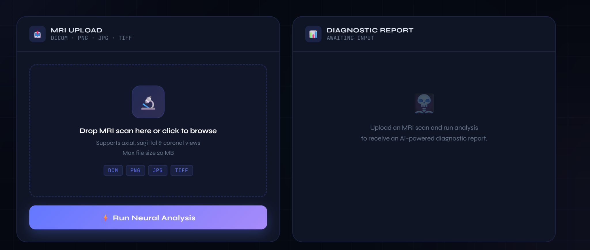
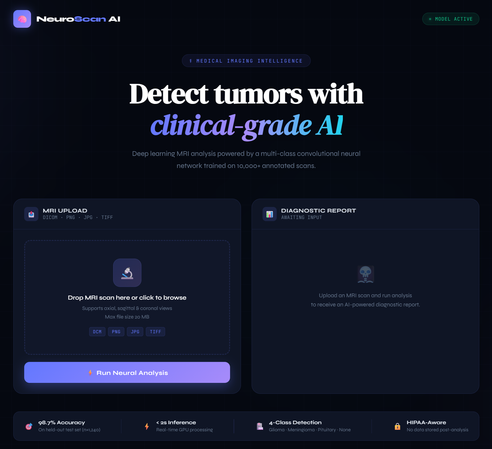

# 🧠 Brain Tumor Detection from MRI using EfficientNetB4

A deep learning based web application that detects **brain tumors from
MRI scans** using **EfficientNetB4 transfer learning**. The model
classifies MRI images into **four categories** and achieves around **95%
test accuracy**.

The project includes:

-   Data preprocessing pipeline
-   EfficientNetB4 training with transfer learning
-   Fine-tuning for improved performance
-   Model evaluation and visualization
-   Flask web application for real-time prediction
-   Deployment-ready backend

------------------------------------------------------------------------

# 🚀 Features

✔ Brain tumor classification from MRI images\
✔ Detects **4 tumor categories**\
✔ Uses **EfficientNetB4 transfer learning**\
✔ Achieves **\~95% test accuracy**\
✔ Web interface for real-time prediction\
✔ Flask backend for inference\
✔ Ready for deployment (Hugging Face / Render)

------------------------------------------------------------------------

# 🖥 Application Interface

### AI Brain Tumor Detection Dashboard

The application provides an intuitive **medical-style diagnostic
interface** where users can upload MRI scans and run AI-powered
analysis.

------------------------------------------------------------------------

### MRI Upload & Diagnostic Report

Users can upload MRI images in multiple formats and run neural analysis
to generate a diagnostic prediction.

Interface features:

-   Drag & drop MRI upload
-   Neural analysis button
-   Diagnostic report panel
-   Model status indicator
-   Real-time prediction output
-   Confidence score visualization
-   Medical-style UI for better usability

------------------------------------------------------------------------

# 🧠 Classes Predicted

The model classifies MRI scans into the following categories:

-   Glioma
-   Meningioma
-   Pituitary Tumor
-   No Tumor

------------------------------------------------------------------------

# 📊 Model Performance

  Metric                  Value
  ----------------------- --------------------
  Test Accuracy           **95.00%**
  Test Loss               **0.2475**
  Total Training Images   **5600**
  Test Images             **1600**
  Input Size              **380 × 380**
  Backbone Model          **EfficientNetB4**

------------------------------------------------------------------------

# 🧠 Model Architecture

The model uses **transfer learning with EfficientNetB4**.

Architecture:

EfficientNetB4 (ImageNet Pretrained)\
↓\
BatchNormalization\
↓\
Dense (256, ReLU)\
↓\
BatchNormalization\
↓\
Dropout (0.4)\
↓\
Dense (128, ReLU)\
↓\
BatchNormalization\
↓\
Dropout (0.3)\
↓\
Dense (4, Softmax)

Total Parameters: **18.17M**\
Trainable Parameters: **\~496K**

------------------------------------------------------------------------

# 📂 Dataset

MRI dataset containing **four tumor categories**:

-   Glioma
-   Meningioma
-   Pituitary Tumor
-   No Tumor

Dataset split used:

  Dataset      Images
  ------------ --------
  Training     5600
  Validation   800
  Testing      800

Dataset structure:

dataset/

Training/\
glioma/\
meningioma/\
pituitary/\
notumor/

Testing/\
glioma/\
meningioma/\
pituitary/\
notumor/

------------------------------------------------------------------------

# ⚙️ Tech Stack

-   Python
-   TensorFlow / Keras
-   EfficientNetB4
-   Flask
-   NumPy
-   Pillow
-   Matplotlib
-   Seaborn
-   Scikit-learn

------------------------------------------------------------------------

# 🏗 Training Strategy

The training process includes two phases:

### Phase 1 --- Transfer Learning

-   EfficientNetB4 backbone frozen
-   Only classifier layers trained

### Phase 2 --- Fine Tuning

-   Entire model unfrozen
-   Lower learning rate used
-   Improves feature learning

Training techniques used:

-   EarlyStopping
-   ReduceLROnPlateau
-   Transfer Learning
-   Fine Tuning

------------------------------------------------------------------------

# 📈 Model Evaluation

The model was evaluated using:

-   Confusion Matrix
-   Classification Report
-   Accuracy & Loss curves

Evaluation performed on **unseen test dataset** to measure
generalization performance.

------------------------------------------------------------------------

# 🖥 Web Application

A **Flask-based web interface** allows users to upload MRI images and
get predictions.

Prediction pipeline:

Upload MRI Image\
↓\
Image Preprocessing\
↓\
EfficientNetB4 Model Prediction\
↓\
Tumor Classification Result

------------------------------------------------------------------------

# 📂 Project Structure

brain-tumor-detection/

app.py\
model_weights.weights.h5\
requirements.txt

templates/\
index.html

static/

training/\
training_notebook.ipynb

screenshots/\
app_dashboard.png\
upload_interface.png

------------------------------------------------------------------------

# 🧪 Run Locally

### 1️⃣ Clone Repository

git clone https://github.com/sandeepkr0209/Brain-Tumor-Detection-using-EfficientNetB4

cd brain-tumor-detection

### 2️⃣ Create Virtual Environment

python -m venv venv

### 3️⃣ Activate Environment

Windows venv`\Scripts`{=tex}`\activate`{=tex}

Mac/Linux source venv/bin/activate

### 4️⃣ Install Dependencies

pip install -r requirements.txt

### 5️⃣ Run Application

python app.py

Open in browser:

http://127.0.0.1:5000

------------------------------------------------------------------------

# 🌍 Deployment

The application can be deployed on:

-   Hugging Face Spaces
-   Render
-   Docker

------------------------------------------------------------------------

# 🔮 Future Improvements

-   Tumor localization using **Grad-CAM**
-   MRI tumor segmentation
-   Mobile application
-   Integration with clinical datasets
-   Model optimization for faster inference

------------------------------------------------------------------------

# 👨‍💻 Author

Sandeep Kumar

AI / Machine Learning Enthusiast

------------------------------------------------------------------------

# ⭐ Support

If you found this project useful, please consider giving it a ⭐ on
GitHub!
